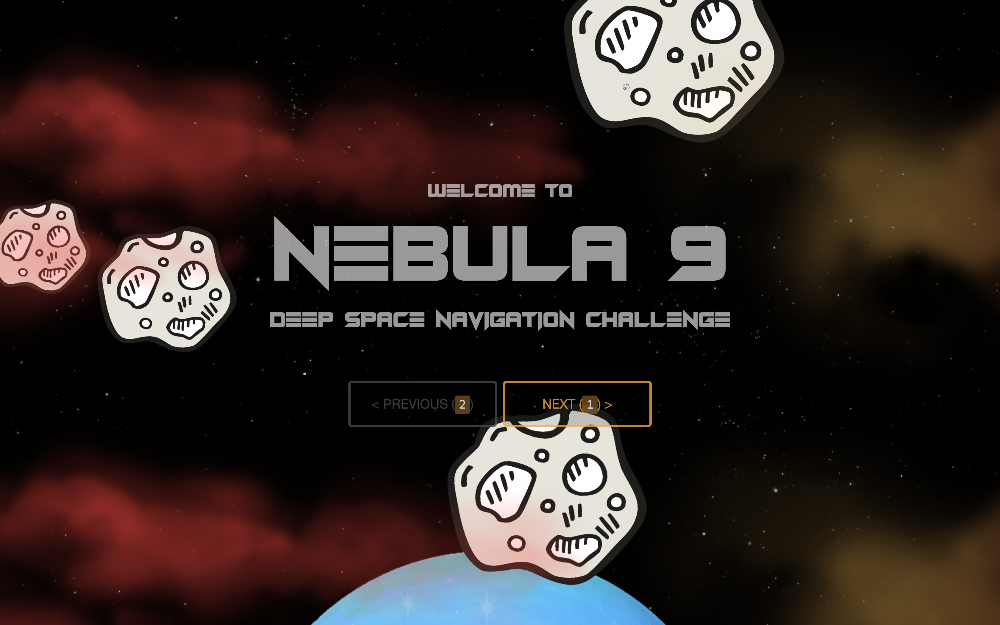

# taskflow-projects

Samples from a growing library of gamified cogntive-training tasks used for research studies at UMN. The premise behind gamification is to both challenge and engage research participants as they undergo intensive cognitive training regimens paried with transcranial direct-current stimulation (tDCS).

These tasks are based on standard psychological tasks that engage working memory, and include variations of:
  - N-back
  - Flanker
  - Dot Pattern Expectancy (DPX)

**NOTE:** The task behavior and layout was *not* designed to be mobile-friendly, as they require keyboard responses.

## How to access tasks
  1. Download and extract src folder
  2. Open index.html
  
### Configuration
These tasks are configured to run from the lab's proprietary server and web platform, which tracks participant sessions and level-up progress. However, they can be run locally, and accessing different levels for a local run is as simple as changing a value in global-configuration.js ( src/js/editor/global-configuration.js ).

```javascript
    /**
     * Local configuration.
     */
    LOCAL: {
        LEVEL: 0, // level number corresponding to levels in configuration.js
        LENGTH: 10 // time in minutes before terminating (or moving to next task when run on server) Waits for current level to finish)
    },
```

## Screenshots

### Nebula 9 (Flanker)




### Dungeon Crawler (Flanker)


